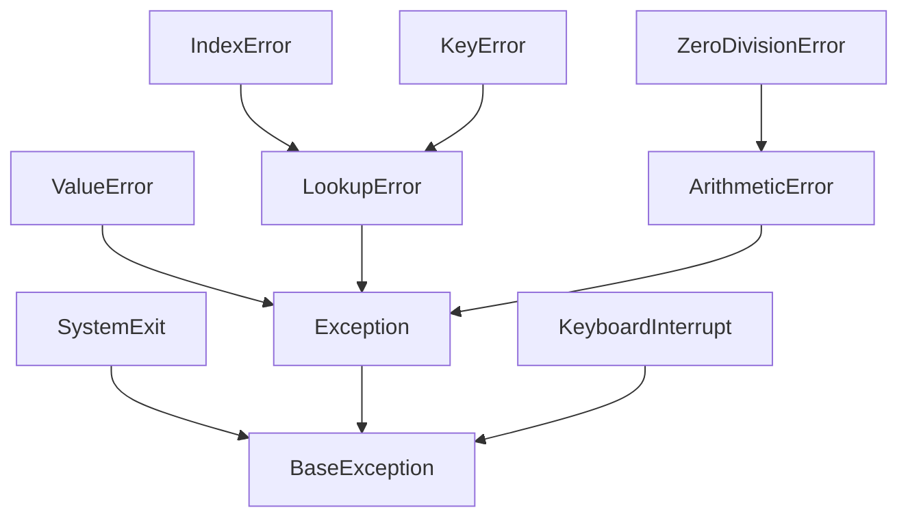
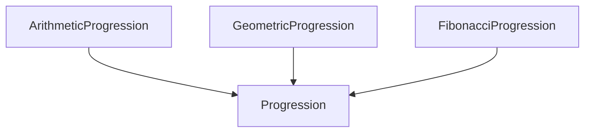

# Python Study

## Object Oriented Programming

- [Python Study](#python-study)
  - [Object Oriented Programming](#object-oriented-programming)
    - [Goals, Principles, and patterns](#goals-principles-and-patterns)
    - [Design Goals](#design-goals)
    - [Oject-Oriented Design Principles](#oject-oriented-design-principles)
    - [Design Patterns](#design-patterns)
    - [Coding Sytle and Documentation](#coding-sytle-and-documentation)
    - [Testing and Debugging](#testing-and-debugging)
    - [Class Definitions](#class-definitions)
      - [Example Class Iterator Class](#example-class-iterator-class)
      - [self identifier](#self-identifier)
      - [constructor](#constructor)
      - [Testing the Class](#testing-the-class)
    - [Operator Overloading and Non-operator overloading](#operator-overloading-and-non-operator-overloading)
      - [non-operator overloading methods](#non-operator-overloading-methods)
      - [overloading methods](#overloading-methods)
      - [Implied methods](#implied-methods)
      - [Example Vector Class](#example-vector-class)
    - [Iterators](#iterators)
      - [Range Class](#range-class)
    - [Inheritance](#inheritance)
      - [Exception hierarchy](#exception-hierarchy)
      - [Extending a class](#extending-a-class)
      - [Numeric Progression Hierarchy](#numeric-progression-hierarchy)
      - [Abstract Base Class](#abstract-base-class)
      - [Namespace and Object-Orientation](#namespace-and-object-orientation)
      - [Nested Classes](#nested-classes)
      - [Dictionaries and the \_\_slots\_\_ declaration](#dictionaries-and-the-slots-declaration)
      - [Name Resolution and Dynamic Dispatch](#name-resolution-and-dynamic-dispatch)
    - [Shallow and Deep Copying](#shallow-and-deep-copying)

### Goals, Principles, and patterns

- **objects**: main actors in object oriented paradigm
- objects are an instance of a class

**class**: presens a concise and consistent view of the objects that are instances of a given class

**instance variables** or **data members** are variables that are specified by the class

**methods** or **member functions**: are functions that the object can execute

### Design Goals

Three main goals:

  1. robustness: software is capabile of handling unexpected input
  2. adaptability: or **evolvability** means that software can change in response to changing conditions in the environment.
       - portability: software can run with minimal change on different hardware and operating system platforms
  3. reusability: same code is usable as a component in various applications.

**Robustness**: softare is capa

**robust** software to be capable of handling unexpected inputs

### Oject-Oriented Design Principles

main objectives:

- modularity: isolate system into components that interact. Easier to isolate where issues arise when something goes wrong. use python **module** a collection of closely related functions and classes
- abstraction: distill complicated system into most fundamental types.
  - **abstract data types**: (ADT) mathematical model that specifies:
    1. type of data stored
    1. operations supported by ADT
    1. **public interface**: types of operations supported
       - **abstract base class**: (ABC) suported by python to create data types
       - can not be instantiated directly
       - **concrete classes** inherit from ABC and provide
          implementations of the methods
  - encapsulation: software components should not reveal internal
    details of their respective implmentations
    - programmers have freedom to implement details of component without impacting other programmers

### Design Patterns

**design patterns**: describes a solution to a typical software design problem

Critical algorithm design patterns:

- recursion
- amortization
- prune-and-search or decrease-and-conquer
- brute force
- dynamic programming
- greedy methods

software engineering design patterns:

- iterator
- adapter
- position
- composition
- template method
- locator
- factory method

### Coding Sytle and Documentation

Programs should be easy to read and maintain. Suggestions for coding in python:

- code blocks indented 4 spaces (do not use tabs)
- meaningful names for identifiers
  - classes should have single noun names in CamelCase
  - functions and member functions of a class should be lowercase
  - member functions and functions should be lowercase with underscore separators
  - names that identify individual object (parameter, instance, variable or local variable) should be lowercase
  - constant identifiers should be specified in uppercase with underscore separators: MAX_SIZE

### Testing and Debugging

- testing plan:
  - check **special cases**, examples for special cases for sequence are:
    - sequence has zero length
    - sequence has one element
    - all elements of sequence are same
    - sequence is already sorted
    - sequence is reverse sorted
  - boundary cases should also be checked
    - inserting and removing beginning and end of list
  - dependencies
  - **top-down**: check the program from top downwards
    - **stubbing**: replace lower-level component with a **stub** (replacement for component that simulates functionality of original) * **bottom up**: lower-level components written before higher level components. Use **unit testing** to check each component
    - **regression testing**: all previous tests re-executed to ensure changes to the software do not introduce new bugs

  - **debugging**:
    - **print**: statements simplest form of debugging
    - **debugger**:  specialied environment for monitoring
      the execution of a program.
      - **breakpoint** insertion withing the code

### Class Definitions

- **class**: primary means for abstraction in object oriented programming

- **member functions** or **methods**: set of behaviours that are commmon to all instances of a class
- **attributes** used by class to store state information
- **attributes** are also known as **fields**, **instance variables**, or **data members**

#### Example Class Iterator Class

```python
class CreditCard:
  """A consumer credit card"""
    def __init__(self, customer, bank, acnt, limit):
      """Create a new credit card instance

           The initial balance is zero.

           customer the name of the customer
           bank     the name of the bank
           acnt     account identifier
           limit    credit limit"""
        self._customer = customer
        self._bank = bank
        self._account = acnt
        self._limit = limit
        self._balance = 0

    def get_customer(self):
      """Return name of the customer."""
        return self._customer
    def get_bank(self):
      """Return the bank's name"""
        return self._bank
    def get_account(self):
        """Return the card identifying number"""
        return self._account

    def get_limit(self):
        """"Return current credit card limit"""
        return self._limit

    def get_balance(self):
      """Return current balance."""
        return self._balance
    def charge(self, price):
        """Charge given price to card if sufficent funds

           Return True if charge otherwise False
        """
        if price + self._banance > self._limit:
           return False
        else:
           retrun True

    def make_payment(self, amount):
        """process customer payment that reduces balance."""
        self._balance -= amount
```

#### self identifier

**self**: syntactically identifies the instance upon which method is invoked.

- each instance get's its own "self" variable
- method get_balance takes zero parameters from the user's perspective.
  - interpreter automatically binds the first parameter "self" to the instance which the method is invoked

#### constructor

- syntax to instantiate the credit card class

```python
cc = CreditCard('John Doe', '1st Bank', '1002 3004 4050 4030', 1000)
```

single leading underscore in the name implies that the method is intended for **nonpublic**

- better to make data members nonpublic by default:
  - provide appropriate update methods

#### Testing the Class

- **method coverage**: percentage of methods that are tested
- **statement coverage**: percentage of statements that are tested

### Operator Overloading and Non-operator overloading

**operator overloading**: use specially named methods to define class behavior when invoked with operators such as "+"

Example operators:

- \_\_mul\_\_: '*' (i.e. multiply)
- \_\_rmul\_\_: '*' (i.e. right multiply)
  - mixed operations of existing class (if it doesn't define the behavior) with the newly created class
- \_\_add\_\_: '+' (i.e. add)

#### non-operator overloading methods

**__str__**: method in user defined classes determines how the class
will be displayed by the **str(foo)** method

Other methods determine how a class can be converted to a boolean, float or other operator.

#### overloading methods

| Common Syntax      | Method Form                                      |
| ------------------ | ------------------------------------------------ |
| a + b              | a.\_\_add\_\_(b); or b.\_\_radd\_\_(a)           |
| a - b              | a.\_\_sub\_\_(b); or b.\_\_rsub\_\_(a)           |
| a * b              | a.\_\_mul\_\_(b); or b.\_\_rmul\_\_(a)           |
| a / b              | a.\_\_truediv\_\_(b); or b.\_\_rtruediv\_\_(a)   |
| a // b             | a.\_\_floordiv\_\_(b); or b.\_\_rfloordiv\_\_(a) |
| a % b              | a.\_\_mod\_\_(b); or b.\_\_rmod\_\_(a)           |
| a ** b             | a.\_\_pow\_\_(b); or b.\_\_rpow\_\_(a)           |
| a << b             | a.\_\_lshift\_\_(b); or b.\_\_rlshift\_\_(a)     |
| a >> b             | a.\_\_rrshift\_\_(b); or b.\_\_rrshift\_\_(a)    |
| a & b              | a.\_\_and\_\_(b); or b.\_\_rand\_\_(a)           |
| a ^ b              | a.\_\_xor\_\_(b); or b.\_\_rxor\_\_(a)           |
| a &#124;  b        | a.\_\_or\_\_(b); or b.\_\_ror\_\_(a)             |
| a +=  b            | a.\_\_isadd\_\_(b)                               |
| a -=  b            | a.\_\_issub\_\_(b)                               |
| a *=  b            | a.\_\_ismul\_\_(b)                               |
| +a                 | a.\_\_pos\_\_(b)                                 |
| -a                 | a.\_\_neg\_\_(b)                                 |
| abs(a)             | a.\_\_abs\_\_()                                  |
| a < b              | a.\_\_lt\_\_(b)                                  |
| a > b              | a.\_\_gt\_\_(b)                                  |
| a <= b             | a.\_\_le\_\_(b)                                  |
| a >= b             | a.\_\_ge\_\_(b)                                  |
| a == b             | a.\_\_eq\_\_(b)                                  |
| a != b             | a.\_\_neq\_\_(b)                                 |
| v in a             | a.\_\_contains\_\_(v)                            |
| a[k]               | a.\_\_getitem\_\_(k)                             |
| a[k]=v             | a.\_\_setitem\_\_(k)                             |
| del a[k]           | a.\_\_delitem\_\_(k)                             |
| a(arg1, arg2, ...) | a.\_\_call\_\_(arg1, arg2, ...)                  |
| len(a)             | a.\_\_len\_\_()                                  |
| hash(a)            | a.\_\_hash\_\_()                                 |
| iter(a)            | a.\_\_iter\_\_()                                 |
| bool(a)            | a.\_\_bool\_\_()                                 |
| float(a)           | a.\_\_float\_\_()                                |
| int(a)             | a.\_\_int\_\_()                                  |
| repr(a)            | a.\_\_repr\_\_()                                 |
| reversed(a)        | a.\_\_reversed\_\_()                             |
| str(a)             | a.\_\_str\_\_()                                  |

**len()**: relies on specially named method __len__() to return the
length of an object. len(foo) actually calls foo.__len__()

NOTE: [\_\_str\_\_ vs \_\_rep\_\_](https://stackoverflow.com/questions/1436703/difference-between-str-and-repr)

- \_\_repr\_\_ goal is to be unambiguous
- \_\_str\_\_ goal is to be readable

#### Implied methods

**exception** is raised by standard method relying upon special method that is not implemented by user defined class

```python
  a + b  # class must have__radd__ or __add__ or an exception will be raised
```

- **\_\_lt\_\_** method will support a < b and indirectly a > b. Having \_\_lt\_\_ and \_\_gt\_\_ will not imply \_\_ge\_\_ automatically.

- **\_\_eq\_\_** if not implemented an object can be compared against itself via the **a** is **b**
method. The a == b will take on behavior of **a** is **b**.

- **\_\_len\_\_** and **\_\_getitem\_\_** commands are implemented a default iteration class is povided automatically

- **\_\_eq\_\_** implemented does not imply that **\_\_neq\_\_** is implemented

undefined **\_\_bool\_\_** method evaluates to False for None and True for all other objects.  It also evaluates to False for objects that have \_\_len\_\_ value of zero and True otherwise.

#### Example Vector Class

```python
    v = Vector(5)  # construct a five dimensional vector <0, 0, 0, 0, 0>
    v[1] = 23      # <0, 23, 0, 0, 0> based on __setitem__
    v[-1] = 45     # <0, 23, 0, 0, 45> based on __setitem__
    print(v[4])    # print 45 via __get__item
    u = v + v      # <0, 46, 0, 0, 90> via __add__
    print(u)       # <0, 46, 0, 0, 90> via __str__

    total = 0
    for entry in v:
      total += entry  # implicit iteration via __len__ and __getitem__
```

```python
class Vector:
  """Represents a vector in multi-dimensional space"""

  def __init__(self, d):
    self._coords  = [0] * d

  def __len__(self):
    return len(self._coords)

  def __getitem__(self, j):
    return self._coords[j]
  
  def __setitem__(self, j, val):
    self.__coords[j] = val

  def __add__(self, other):
    if len(self._coords) != len(other):
      raise ValueError('dimensions must agree')

    result = Vector(len(self))

    for j in range(len(self)):
      result[j] = self[j] + other[j]
    return result
  
  def __eq__(self, other):
    return not self == other  # using self.__eq__ method
  def __str__(self):
    return '<', str(self._coords)[1:-1] + '>'
```

### Iterators

**iterator** for collection provides key behavior to return next item in list via the \_\_next\_\_ method.

- if not item in the sequence is available it raises the **StopIteration** error

**generator** preferred approach to create an iterator via the yield syntax

**Automatic Iterator** provided by python if a class implements

- \_\_len\_\_
- \_\_getitem\_\_

```python
# sample class with explicit iterator

class SequenceIterator():
  def __init__(self, data):
    self._seq = sequence
      self._k = -1

  def __next__(self):
    self._k += 1
      if self._k < len(self._seq):
        return self._seq[self._k]
    else:
      raise StopIteration()
  def __iter__(self):
    """Iterator must return self as an iterator """
    return self
```

#### Range Class

**lazy evaluation** represens entire range of objects in memory without having to create them

```python

  class Range:
    """A class that mimic's the built-in range class"""

    def __init__(self, start, stop=None, step=1):
      if step == 0:
        raise ValueError('step can not be 0')

      if stop is None:
        start, stop = 0, start


      self._length = max(0, (stop - start + step - 1) // step )

      self._start = start
      self.step = step

    def __len__(self):
      return self._length


    def __getitem__(self, k):
      if k < 0:
        k += len(self)
      if not 0 <= k < self._length:
        raise IndexError('index out of range')
      return self._start + k * self._step

```

### Inheritance

- **hierarchical** similar abstract definitions grouped together level by level in the hierarchy
- **inheritance** allows a new class to be defined based on an existing class
- **terminology**:
  - **base class**
  - **parent class**
  - **super class**
  - **subclass** or **child class**: newly defined classes relationship to the **parent class**
- **differentiation**: subclass can differentiate itself from parent class
  - **specialize** existing behavior by **overriding** existing method
  - **extend** superclass to add additional functionality

#### Exception hierarchy



- **BaseException** class is root for all exceptions
- **Exception** class contains majority of common exceptions

#### Extending a class

- **specify inheritance** place class definition in the **class** declarations
- **super** need to call inherited constructor to ensure proper initialization
- **protected** members are accessible to subclasses but not general public. A single underscore in front of identifier by convention specifies a protected identifier. Python has no formal enforcement
- **private** members are not accessible to public or subclasses. A double underscore designates these methods.

```python
  # class PredatoryClass inherits from CreditCard class
  class PredatoryCardClass(PredatoryClass)
  
    def __init__(customer, bank, actn, limit, apr):

      # call the inherited constructor
      super().__init__(customer, bank, acnt, limit)
      self._apr = apr

    # method overrides charge method in th parent
    def charge(self, price):
      # use super() to gain access to parent's charge
      success = super().charge(price)
      if not success:
        self._balance += 5
      return success

    # new behavior that does not require inheritance
    def process_month(self):
      # _balance is protected naming convention and is ok to access with subclass
      if self._balance > 0:
        monthly_factor = pow(1 + self._apr, 1/12)
        self._balance *= monthly_factor
```

#### Numeric Progression Hierarchy



```python
  class Progression:
    def __init__(self, start=0):
      self._current = start

    def _advance(self):
      self._current += 1

    def __next__(self):
      if self._current is None:  # our convention to end progression
        raise StopIteration()
      else:
        answer = self._current
        self.advance()
        return answer

    def __iter__(self):
      # by convention return self for iterator
      return self

    def print_progression(self, n):
      print(' '.join(str(next(self)) for j in range(n)))
```

```python
  class ArithmeticProgression(Progression):
    def __init__(self, increment=1, start=0)
      super().__init__(start)  # initialize base class
      self._increment = increment

    def _advance(self):
      self._current += self.increment
```

```python
  class GeometricProgression(Progression):
    def __init__(self, base=2, start=1):
      super().__init__(start)
      self._base = base

    def _advance(self):  # override inherited version
      self._current *= self._base
```

```python
  class FibonacciProgression(Progression):
    def __init__(self, first=0, second=1):
      super().__init__(first)  # start progression at first
      self._prev = second - first

    def _advance(self):
      self._prev, self._current = self._current, self._prev + self._current # simultaneous assignment
```

#### Abstract Base Class

- **abstract base class** a class whose only purpose is to serve as a base class through inheritance
- **concrete class** a class that can be instantiated
- **abc** module defines formal method of defining abstract base class.
- **template method pattern** abstract base class provides concrete behaviors that depend on calls to other abstract behaviors

```python

  from abc import ABCMeta, abstractmethod

  # metaclass keyword: provides template for implementation
  #     raises error if instantiated
  class Sequence(metaclass=ABCMeta):

    @abstractmethod # declares that method is not defined in base class
    def __len__(self):
      """returns length"""

    @abstractmethod
    def __getitem__(self, j):
      """returns element at index j of sequence"""

    def __contains__(self, val):
      """Returns True if val found in sequence; False otherwise"""
      for j in range(len(self)):
        if self[j] == val:
          return True
        return False

    def index(self, val):
      for j in range(len(self)):
        if self[j] == val:
          return j
      raise ValueError('value not in sequence)

    def count(self, val):
      k = 0
      for j in range(len(self)):
        if self[j] == val
          k += 1
        return k
```

#### Namespace and Object-Orientation

- **namespace** an abstraction that managers all identifiers defined in a particular scope
- **instance namespace** manages namespace of each individual object
  - a single instance space per object
  - use of "self" qualifier for an identifier causes identifier to be added to the instance namespace
- **class namespace** managers members that are shared by all instances of a class without reference to any particular instance
  - includes all declarations made directly in the body definition of the class
- **class data members** used when a value that is shared by all instances of a class
  - define identifier in the immediate scope of the class definition

```python
  class PredatoryCreditCard(CreditCard):
    OVERLIMIT_FEE = 5

    def charge(self, price):
      success = super.charge(price)
      if not success:
        self._balance += PredatoryCreditCard.OVERLIMIT_FEE
      return success
```

#### Nested Classes

- **nest** possible to next one subclass inside another
  - makes it clear subclass exists for supporting outer class
  - reduces likelihood of name conflict
  - allows for more advanced form of inheritance in which subclass of outer class overrides the definition of the nested clss

#### Dictionaries and the \_\_slots\_\_ declaration

- **by default** python represents each namespace with a built-in dictionary class
  - dictionary requires additional memory usage beyond raw data for lookup
- **\_\_slots\_\_** provides more streamlined representation for all instances of a class
  - class defintion must provide a class member function "\_\_slots\_\_" that is assigned to a fixed sequence of strings that serve for the instance variable
  - when using inheritance the base class declares \_\_slots\_\_, a subclass must also declare
    \_\_slots\_\_ to avoid creation of instance dictionaries
  - particularly useful when given class is expected to have many instances

```python
  class CreditCard:
    __slots__ = '_customer', '_bank', '_account', '_balance', '_limit'
```

#### Name Resolution and Dynamic Dispatch

- **retrieving** existing member of an object using the dot notation
  1. instance namespace is searched; if name found its associated value is returned
  1. if name is not found the class namespace for the class to which instance belongs is searched. if name is found its associated value is returned
  1. if name is not found in the immediate class namespace, search continues upwards through the inheritance hierarchy, checking the class namespace for each ancestor (commonly by checking the superclass class, then its superclass and so on). The first time a name is found its associated value is used.
  1. if the name has not still been found, an AttributeError is raised.
  
- **overriding**: existance of function in the subclass has effect of overriding the version of the function in the parent class
- **dynamic dispatch** or **dynamic binding** used by python to call appropriate implementation of a function based on the type of object that it is invoked upon
- **static dispatch** compile time decisions are made to determine what function to call based on the typ e of the declared variable

### Shallow and Deep Copying

- **alias** assignment statement makes an alias for the object
  - foo = bar
  - no **copy** of the original is made
- **shallow copy** made by list() constructor. New list is initalized so that its contents are precisely the smae as the original sequence
  - lists are referential, so new list represents a sequence of references to the same elements as the first
  - elements can be added or removed, however shallow copy list can be impacted by changes made to original objects

- **deep copy**
  - new copy references its own **copies** of those referenced in original version

```python
  import copy
  palette = copy.deepcopy(warmtones)
```
